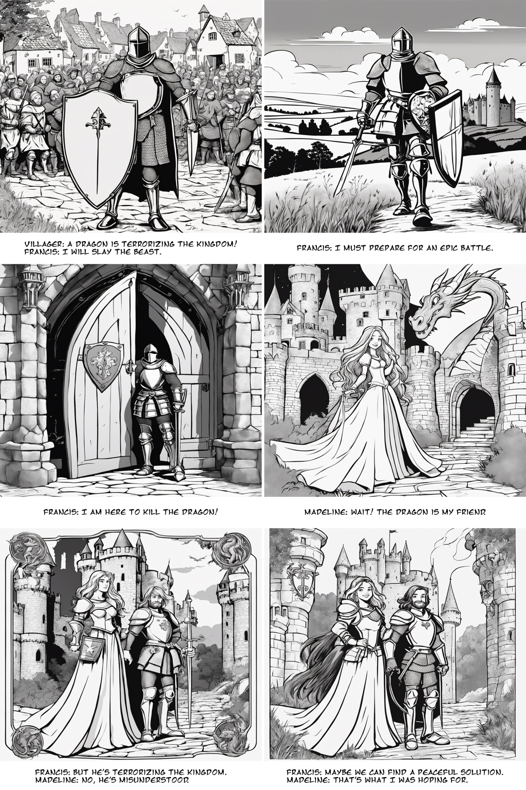
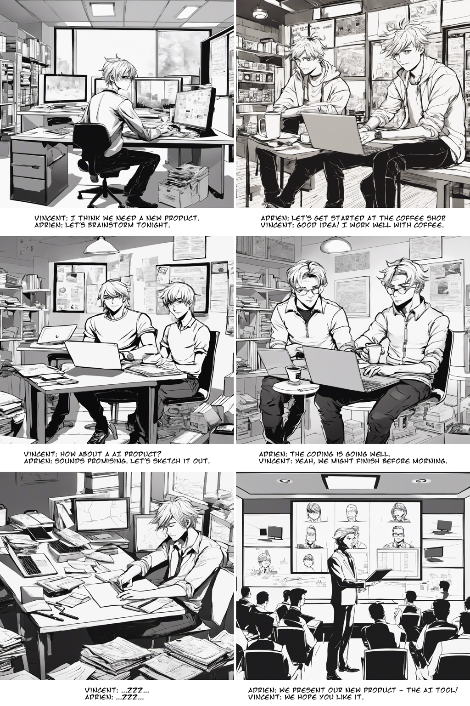

# Comics Generator

This program use Generative AI to create an entire comic strip from a short scenario.

The scenario must mention the characters with a physical description.

## How it works

First, a LLM (OpenAI API) is used to split the scenario into 6 panels with their description and associated text.

Then for each panel:
 - an image is generated with Stable Diffusion (Stability API).
 - the panel text is added to the image

The 6 generated images with their texts are then merged into a final strip !

## Usage

Export `OPENAI_API_KEY` and `STABILITY_KEY`.

Install dependencies: `pip install langchain openai stability-sdk pillow`

Then edit the `SCENARIO` variable in [kartoon.py](kartoon.py).  
You can also edit the `STYLE` variable to change the style.  

Run the script: `python kartoon.py`

## Examples

Style belgium comic

```
Characters: Francis is medieval knight with a shield. Madeline is a princess with long hair.
Francis hear about a dragon that is terrorizing the kingdom. He goes to the castle to kill the dragon in an epic battle. The princess is angry because the dragon was her friend.
```



Style manga

```
Characters: Adrien is a guy with blond hair. Vincent is a guy with black hair.
Adrien and Vincent work at the office and want to start a new product, and they create it in one night before presenting it to the board.
```


